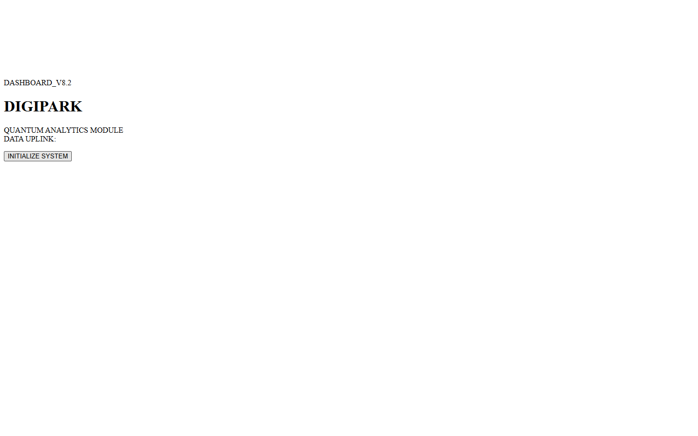
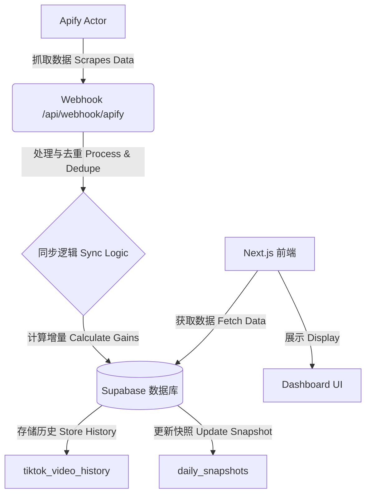

# Digibeat 项目文档

## 1. 项目概览 (Project Overview)
**Digibeat** 是一个专为 TikTok 和 Instagram 账号设计的社交媒体分析看板 (Dashboard)，用于追踪和可视化每日关键指标 (浏览量、点赞、评论、分享)。它通过每日快照 (Daily Snapshot) 和真实增量计算 (True Daily Gains) 解决了平台原生数据缺乏“历史细粒度”的问题。

## 2. 核心功能 (Key Features)

### 2.1 每日快照与真实增量 (Daily Snapshots & True Gains)
- **痛点**: 平台通常只显示“累计总数”，无法看到昨日具体的增长。
- **解决方案**: 我们每日抓取数据，并使用 `今日 - 昨日` 的逻辑计算每条视频的*精确增量*。
- **价值**: 精准追踪每日表现，排除“历史遗留数据”的干扰。

### 2.2 数据看板可视化 (Dashboard Visualization)
- **趋势图 (Timeline Charts)**: 查看每日浏览量随时间的变化趋势。

- **多维对比 (Small Multiples)**: 并排比较多个账号 (如 `joyfulsydney` vs `ave.lightmoments`) 的表现。

- **下钻分析 (Drill-Down)**: 点击任意日期或账号，即可查看当日具体是*哪些视频*贡献了增长。

### 2.3 自动同步 (Automated Sync)
- **Apify 集成**: 通过 Apify 自动抓取 TikTok/Instagram 数据。
- **Webhooks**: 抓取完成后立即通过 Webhook 推送到 Next.js API。
- **高可用 (Resilience)**: 包含去重和“Upsert”逻辑，确保数据完整性，即使重试也不会导致数据重复。

## 3. 架构与数据流 (Architecture & Data Flow)

## 4. 使用指南 (Usage Guide)

### 4.1 查看看板 (Viewing the Dashboard)
1. 打开首页。
2. 选择 **Target Date (目标日期)** (默认为今日)。
3. 切换 **TikTok** / **Instagram** 标签页。
4. **Metric Toggle (指标切换)**: 在 Views/Likes/Comments 之间切换。

### 4.2 数据同步 (Syncing Data)
- **自动同步**: 通过 Cron 每日定时触发。
- **手动同步**: 点击顶部的 **"Sync Now"** 按钮可立即触发刷新。

### 4.3 下钻详情 (Drill Down)
- 点击图表中的柱条或网格卡片。
- 下方会出现详细表格，列出当日所有贡献增长的视频详情。

## 5. 技术栈 (Technology Stack)
- **Frontend**: Next.js 14 (App Router), TailwindCSS, ECharts.
- **Backend**: Next.js API Routes.
- **Database**: Supabase (PostgreSQL) + RLS Policies.
- **Data Source**: Apify.
